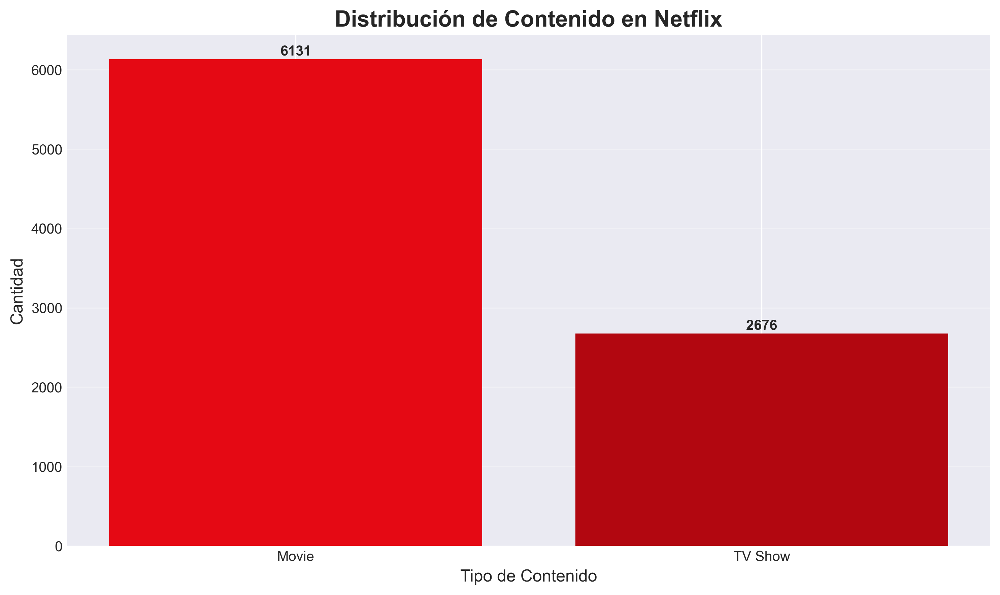
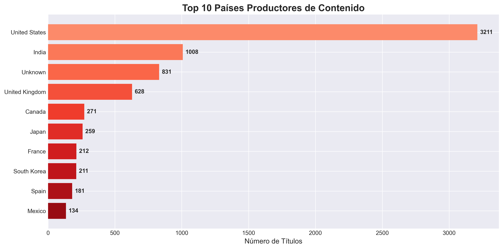
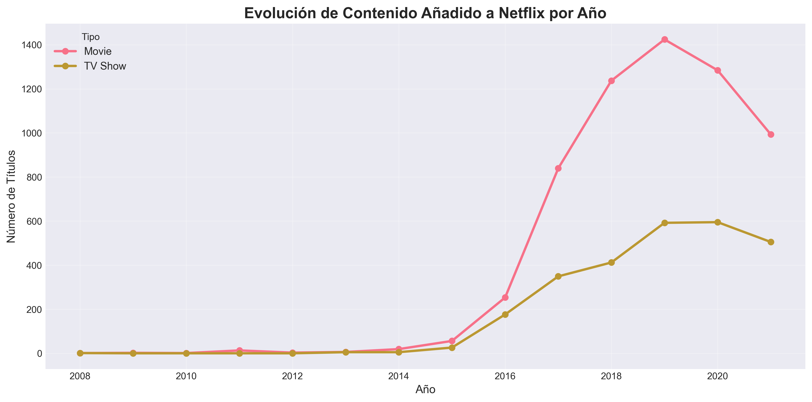
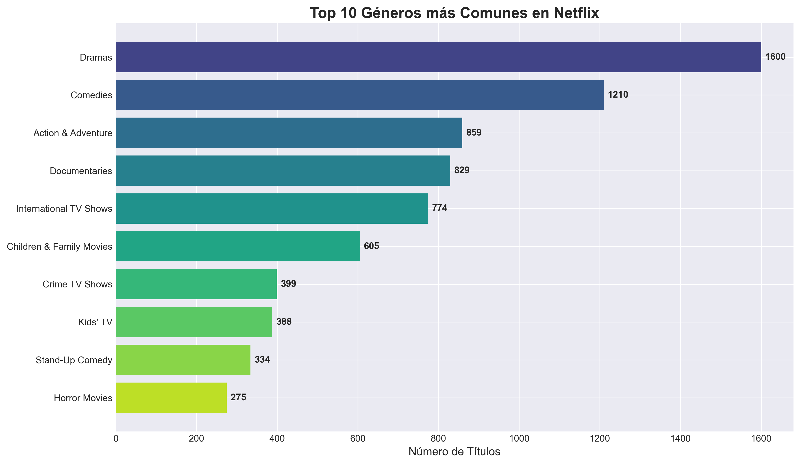

# Netflix Content Analysis

Proyecto en **Python** para analizar un dataset de contenidos de Netflix y sacar conclusiones con gráficos y algunas visualizaciones/diagramas.

## Objetivo
Explorar el catálogo (películas y series) y responder preguntas típicas como:
- distribución por **tipo** (Movie/TV Show)
- contenidos por **año**
- países con más títulos
- géneros/categorías más comunes
- duración (en películas) o número de temporadas (en series)

## Qué incluye
- Limpieza y preparación de datos
- Análisis exploratorio (EDA)
- Gráficas y visualizaciones
- Diagramas / imágenes exportadas para el informe

## Requisitos
- Python 3.x

Librerías habituales (según tu notebook/script):
- pandas
- numpy
- matplotlib
- seaborn

## Cómo usar
1. Clona o descarga el repositorio.
2. (Opcional) Crea un entorno virtual e instala dependencias.
3. Ejecuta el notebook o el script principal del proyecto.

Ejemplo:
```bash
python main.py
```

## Resultados (diagramas / capturas)
Aquí puedes dejar algunas imágenes del análisis (si están en el repo, cambia la ruta por la correcta):
| Visualización | Descripción |
|---------------|-------------|
|  | Distribución de tipos de contenido |
|  | Top 10 países productores |
|  | Evolución temporal del catálogo |
|  | Géneros más comunes |

## Estructura (ejemplo)
```text
Netflix_Content_Analysis/
├─ data/               # dataset(s)
├─ notebooks/          # notebooks de análisis
├─ src/                # scripts (si aplica)
├─ docs/img/           # imágenes/diagramas exportados
└─ README.md
```

## Notas
- Si algún gráfico no aparece, revisa las rutas a `docs/img/` o genera de nuevo las figuras ejecutando el notebook.
